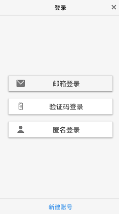
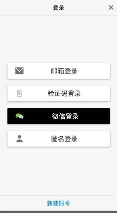
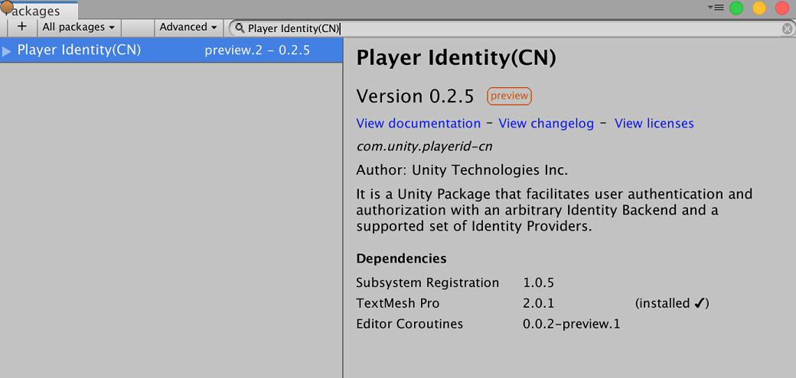
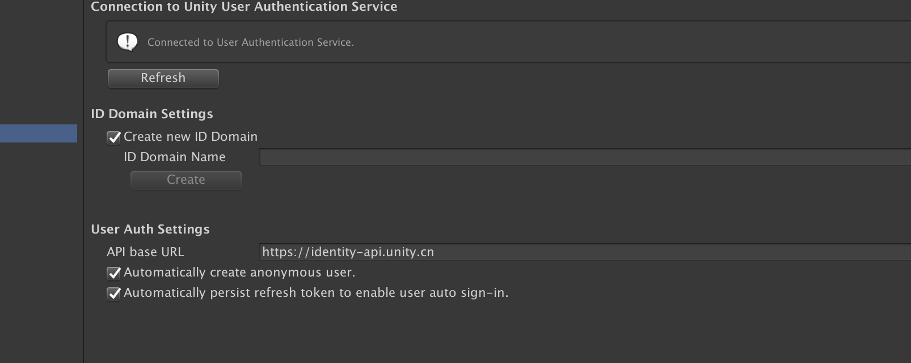
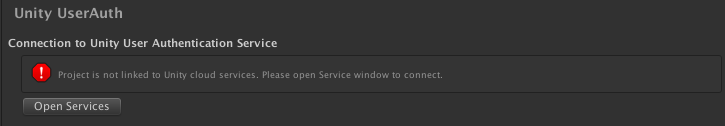
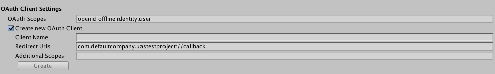
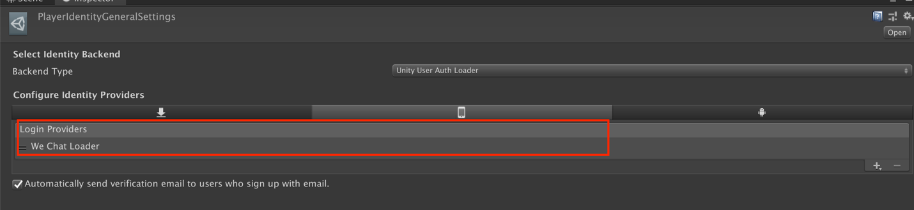

# Unity Player ID

## 概要

### 概述

Unity玩家账号系统（Player Identity，简写为Player ID）能够帮助开发者方便的构建安全的身份验证系统。我们支持以下登录方式供开发者使用:

* 匿名登录
* 邮箱密码登录
* 手机号码登录
* 微信登录 （暂时只支持Android,ios平台登录，以后版本加入其他平台）

开发者可以通过使用PlayerId的SDK来使用PlayerId服务。PlayerId SDK以[package](https://docs.unity3d.com/Packages/com.unity.package-manager-ui@1.8/manual/index.html) 的形式发布,其中包含了可以直接使用的UI资源 [user auth prefab](https://docs.unity3d.com/Manual/Prefabs.html)。




Figure 1 Editor Play Mode示例



Figure 2 安卓手机示例（添加微信登录之后）

在该文档中我们讲介绍以下内容：
* PlayerId package设置
* PlayerId prefab的UI修改
* PlayerId prefab 的使用

|         |            |
| ------------- |-------------|
| Unity开发需求        | <ul><li>Unity 2019.2.</li><li>Unity 开发者账号</li></ul>|
| 手机版本需求        | <ul><li>iOS version 13+</li><li>Android version 6+</li></ul>|


**注意**: 如果想使用其它的身份认证服务器, 可参考[扩展部分](#扩展部分).


## 下载PlayerId SDK

PlayerId SDK需要Unity 2019.2及以上。开发者可以通过Unity的 Package Manger Window 下载PlayerId SDK.  
* 通过**Window ► Package Manger**打开Package Manger Window
* 勾选 **Advanced ► Show preview packages**
* 搜索package并安装, 关键字为Player Identity(CN)。




安装并导入后，便可看到在项目的Packages目录下看到Player Identity package.  


**注意**： PlayerId(CN)目前只在中国发布，如果是国外IP将无法在Package Manager里搜索到该package.


## 登录选项设置

开发者首先需要在Unity里对PlayerId进行登录选项的设置。
1. **启动Unity编辑器**

	版本号为2019.2.x及以上, 新建一个项目或者使用已有项目皆可. 

1. **初始化设置**
	打开 Edit ► Project Settings, 打开**Player Identity ► Backends ► Unity User Auth**。
	
	**连接到 Unity Cloud Service**

	如果你新建一个项目，跳出如下错误页面. 请按照提示连接到Unity Cloud Service. 
	

	点击Open Services按钮. 根据 网页上 的提示创建Unity Cloud Services ID。

	**项目设置**
	
	在 Unity UserAuth 页面进行设置. ( **Player Identity ► Backends ► Unity User Auth**). 
	

	默认情况下，User Auth Settings提供如下登录方式:
	* 匿名登录
	* 邮箱登录
	* 手机登录（验证码登录）

	在使用之前，需进行如下设置:
	* **创建ID Domain**
	* **创建OAuth2 Client**

	ID Domain 相当于用户资源组，比如:
	* 所有项目共享一个ID domain (那么所有项目的用户是共同管理的) 
	* 每个项目一个 ID domain ( 项目之间用户是独立的).

	按 **Project Settings ► Player Identity ► Backends ► Unity UserAuth** 进入设置页面 

	**ID Domain 设置**

	新建ID Domain. 选中**Create new ID domain**  

	|  **Field**    |   **Default** | **Notes** |
	| ------------- |-------------|-------------|
	| ID Domain 名称        | 无 | 任意名称都可以（当前无限制）|

	在点击Create按钮之后，新建的ID Domain会出现在选择框中，ID Domain的id会和名称一起显示在选择框中。
	


	**OAuth Client 设置**
	新建OAuth2 Client. 以下为需要填写的信息.

	|  **Field**    |   **Default**     | **Notes** |
	| ------------- |-------------|-------------|
	| OAuth Scopes  | openid offline identity.user |这些scope提供以下权限: <ul><li>openID -  使用如微信的第三方登录</li><li>offline – 获取refresh tokens</li><li>identity.user – 关联第三方帐号</li></ul>|
	| Client Name  | 无 | 任何字符都可（目前为限制）|
	| Redirect URIs  | 一个默认值 | 请不要做修改 |
	| Additional Scopes  | 无 | 自定义的scope，可不填 |

	
	点击Create 创建(如果不可点击，可以点击Refresh按钮).  
	新建的OAuth Client 将会出现在下拉框中, 同样的，id值会加在client 名称之前. 在authorization APIs 中(参考 API 文档), 这个id值会作为参数 “client_id”.

	**ID Provider 设置**
	具体参考 第三方登录——微信登录 


	**User Auth 其它设置**

	|  **字段**    |   **默认值**     | **描述** | **对用户的影响** |
	| ------------- |-------------|-------------|-------------|
	| API base URL  | `https://identity-api.unity.cn` |请使用默认值，这是服务器地址|无|
	| Automatically create anonymous user | 开启 |是否为用户自动创建一个匿名用户 | 如果不勾选的话，将不会对未登录的用户创建匿名用户。
	| Automatically persist refresh token to enable user auto sign-in  | 开启 | 自动使用token登录 |可以实现自动登录|

1. **微信登录**

	首先需要在微信开发平台进行开发者帐号注册,并获得相应的AppID和AppSecret。
	在获得AppID和AppSecret之后, 可以进行微信登录设置。
	1. 在 **Project Settings ► Player Identity ► Backends ► Unity UserAuth**页面进行微信登录设置，勾选create new ID provider，并在下拉框中选择 `wechat.com`

		填写client ID 和 client Secret。

		|     **字段**   |   **默认值**     | **描述** |
		|-------------|-------------|-------------|
		|     client ID  | 无 |微信开发平台的AppID|
		|     client Secret | 无 |微信开发平台的AppSecret|
		
		点击“Save”按钮存储到服务器。其中client secret用于服务端获得微信的access_token。可参考[微信官方文档](https://developers.weixin.qq.com/doc/oplatform/Website_App/WeChat_Login/Wechat_Login.html)。  

		如果开发者需要通过自己的服务获取微信的access token，可以不需在这填写client secret和client id。开发者需要在**Project Settings ► Player Identity ► Providers► WeChat**里设置Callback Endpoint。Callback Endpoint是一个url,sdk会发送http请求到这个url来获取access token. SDK发送的请求如下  
		`GET ${Callback Endpoint}?code={微信返回的auth code}&appid={微信appid}`
		
		开发者需要返回的json格式如下：
		```
		{
			"openid": "微信openid",
			"access_token": "微信access token",
			"errmsg": "错误消息",
			"errcode": 0
		}
		```

	1. 在 **Project Settings ► Player Identity ► Providers► WeChat** 页面进行微信登录设置

		|     **字段**   |   **默认值**     | **描述** |
		|-------------|-------------|-------------|
		|     App ID  | 无 |微信开发平台的AppID|
		|     Callback Endpoint | 无 |如果开发者通过自己的服务端来获取微信的access token则需要填写。|
		|     Generate Callback code | 勾选 |是否使用该package提供的默认微信回调方法，该方法用户接收[微信的返回值](https://developers.weixin.qq.com/doc/oplatform/Mobile_App/Access_Guide/Android.html)。如果需要自己实现回调函数请取消勾选。|

		注意这里的app id和上面的client id是一个值，但这里是在拉取微信，也就是获得code时用到，必须填写
	1. 添加微信登录选项
		依次选中 **Project Settings ► Player Identity**
		在 Select Identity Backend栏中使用默认值。

		|     **字段**   |   **默认值**     | **描述** |
		|-------------|-------------|-------------|
		|     Backend Type  | Unity User Auth Loade |使用默认选项|

		在 **Configure Identity Providers** 栏中 ，选择想要设置的平台图标。 点击“+” 图标 进行添加第三方登录方式. 选择“We Chat Loader”。目前微信登录支持Android和IOS平台。


		填写identification以完成微信登录回调：
		* Android根据 微信上注册的信息填写package name(**player settings->project settings->player->android icon->other settings**)
		* IOS，根据微信上注册的信息填写bundle identifier(**player settings->project settings->player->ios icon->other settings**)

1. **其他设置**

	在**Project Settings ► Player Identity**里你也可以选择是否自动发送验证邮件给这些用邮箱注册的用户:

	|     **字段**   |   **默认值**     | **描述** |
	|-------------|-------------|-------------|
	|     Automatically send verification email to<br> users who sign up with email.  | 开启 |默认情况下会自动发送验证邮件。<br>如果功能开启了, 当用户用邮箱注册或者关联邮箱 ，都会自动发送验证邮件|

1.  **手机登录**
	默认支持无需其他配置。


## Prefab的使用
PlayerId提供了Prefab来实现用户登录/注册流程的用户界面，开发者可以直接进行使用。

1. 导入Prefab  
	如果你完成了前述的步骤， Player Identity 包则已经添加到你的包依赖中。接下来，点开 Project 栏(默认情况下，位于Unity编辑器的下方), 一次打开目录**Packages  ► Player Identity  ► Prefabs**. 将UserAuthPrefab 拖入 Hierarchy 面板.  编辑器弹出TMP (TextMeshPro) 的安装提示框，如果你还没有安装过。

2. 设置Prefab(可选)   

	在按上述步骤倒入UserAuthPrefab之后, 选中（即单击）hierarchy中的UserAuthPrefab，然后在inspector栏中可以看到一些设置选项.

	__Player Identity Core (Script)__

	这个脚本是用来处理prefab中的触发事件的. 下表中列出了可添加附加动作的触发事件。 可以通过点击“+”按钮来添加函数回调（注意事件分为运行时，编辑模式和关闭三种选项）. 当然，也可通过点击“-”删除不再需要的函数回调。

	注意: “List is Empty”（列表为空）意味着没有事件处理回调 。下表给出了事件触发后的默认动作。
	
	|     **事件名称**   |   **默认动作及模式**     | **触发时机** |
	|-------------|-------------|-------------|
	| On Anonymous Login () | 模式: 运行时<br>动作: MainController.OnLogin |匿名登录完成后触发|
	| On Login () | 模式: 运行时<br>动作: MainController.OnLogin |登录完成后触发|
	| On Logout () |模式: 运行时<br>动作: MainController.OnLogout | 退出后触发 |
	| On Access Token Changed () |无（即列表为空） |当访问令牌（access token）值改变之后触发 |
	| On Error () | 模式: 运行时<br>动作: MainController.OnError | 当出现错误时触发 |
	| On Link () | 模式: 运行时<br>动作: AccountPanel.OnLinkCompleted | 关联（link）第三方帐号后触发 |
	| On Unlink () | 模式: 运行时 <br> 动作: AccountPanel.OnUnlinkCompleted | 删除第三方帐号关联后触发
	| On Change Password() | 无 | 修改密码完成后的动作 |
	| On Reset Password () |无 |重置密码之后.|
	| On Create Credential () | 无 | 匿名用户添加邮箱之后 |
	| On Get User () |无 | 获取用户信息之后 |
	| On Update User () | 无 | 完成更新用户信息之后 |
	| On Verify Email () | 无 |用户完成邮箱验证之后 |


	__Main Controller (Script)__

	该脚步提供以下选项：

	* Panel Controller：页面控制脚本
	* Login Status Controller：登录状态脚本
	* Popup Controller：弹出脚本
	* Prefab中已经给了默认脚本。如果需要添加一些功能，也可使用自己实现的功能脚本。

	__Customizer Manager (Script)__  

	该脚本暂不提供定制选项。

	__Customizer (Script)__

	提供一些修改prefab视觉效果的选项. 比如字体选项可以通过点击font asset一栏apply按钮左边的圆形图标来选择。然后点击apply按钮使用（可通过play模式查看效果）。

	更多关于定制化选项的信息可以参考附录 部分。


## 运行游戏
PlayerId提供的大部分功能都可以在Unity编辑器play模式下进行测试。 然而，与第三方登录、认证相关的功能暂无pc端支持，故只能在手机端（安卓或苹果）测试。

1. Unity 编辑器操作流程

	在Unity编辑器中可以对匿名登录，邮箱密码登录以及手机号码登录进行测试.
	以下给出一个操作示例：

	匿名用户

	1. 找到登录按钮，并点击
	1. 进入登录面板
		1. 点击匿名登录
	1. 登录成功后，页面将出现帐号按钮，点击进入用户帐号信息页面
	1. 在帐号面板中，可对匿名用户进行如下操作
		1. 添加邮箱
			1. 在用户用邮箱新建帐号后，该用户在匿名帐号下的数据将会关联到新建帐号上。
			1. 如果没有关联其它非匿名登录方式，邮箱不能被解除绑定
			1. 验证邮件将会自动发送到绑定的邮箱（也可点击验证邮件再次发送）
			1. 可点击“邮箱登录” 
		1. 微信登录
			1. 关联到微信帐号后，该用户在匿名帐号下的数据将会关联到微信帐号上。
			1. 如果没有关联其它非匿名登录方式，微信不能被解除绑定
			1. 之后可用微信帐号登录该帐号
		1. 退出操作
			1. 用户退出后，需点击匿名登录再次使用退出的匿名帐号
			1. 匿名帐号的token是被保存的，因此信息不会丢失

	邮箱注册用户

	1. 点击登录按钮
	1. 进入登录面板
		1. 点击邮箱登录
		1. 可点击忘记密码以重置密码
		1. 键入邮箱密码，以登录
	1. 登录成功后，页面将出现帐号按钮，点击进入用户帐号信息页面
	1. 在帐号面板中，可对匿名用户进行如下操作
		1. 如果邮箱还未验证，页面会显示验证邮箱按钮，可点击发送邮箱（仅对未验证用户可见）
		1. 点击修改密码按钮进行密码修改
		1. 微信登录
			1. 关联到微信帐号后，该用户数据将会关联到微信帐号上。
			1. 由于此时有两个登录方式，用户可解除绑定其中任一个
			1. 可以通过微信登录按钮进行登录


1. iOS应用的编译
	按照**File ► Build Settings**进入设置页面
	1. 点击Add Open Scenes 将包含prefab的场景添加到Scenes in Build，如下图
	1. 切换到iOS平台
	1. 在**Project Settings ► Player Identity**下，选中iOS平台，添加需要的第三方登录provider（如微信登录）.
	
	1. 填写**Project Settings ► Player ►  Settings for iOS**下的bundle identifier（微信登录需要使用），以及其它你需要使用的选项。然后点击build按钮

	注意: 仅macOS Catalina平台  
	如果你是macOS Catalina, 则必须添加OpenGLES3 图形API.。
	1. 点击**Project Settings ► Player**. 
	1. 点击Settings for iOS. 
	1. 取消Auto Graphics API 选项. 
	1. 在Graphics APIs 列表中:
		* 点击+ 按钮，添加OpenGLES3.
		* 点击“-” 删除Metal.

1. Android  应用的编译  
    **在build.gradle里添加依赖**  
    编译Android项目需要在**build.gradle**里添加以下依赖:
    
    ```  
    ...  
    dependencies {
        ...
        implementation "androidx.browser:browser:1.2.0"
        ...
    }
    ...
    ```
    如果要启用APPLE 登录,**Unity Editor2020**版本中需要在**gradleTemplate.properties** 文件中添加
    
    ```  
   android.useAndroidX=true
android.enableJetifier=true
    ```
     
    如何在Unity里修改gradle设置，可以参考文档[**Unity Gradle for Android**](https://docs.unity3d.com/Manual/android-gradle-overview.html)里的
    **Providing a custom Gradle build template**部分。
	
	按照**File ► Build Settings**进入设置页面
	1. 点击Add Open Scenes 将包含prefab的场景添加到Scenes in Build，如下图
	1. 切换到Android平台
	1. 在**Project Settings ► Player Identity**下，选中Android平台，添加需要的第三方登录provider（如微信登录）.
	1. 填写Project Settings ► Player ►  Android Settings 下的Package name（微信登录需要使用），以及其它你需要使用的选项。然后点击build按钮

## 附录

个性化菜单选项  

|    |     |    |    | 功能 |
|-------------|-------------|-------------|-------------|-------------|
| Main |General |Font Asset |   |改变prefab的字体|
|       |General |Size |   |改变prefab主面板的大小|
|       |General |Vertical Group Spacing  |   |改变按钮之间的垂直间隔|
|Action Bar |General| Height| | 改变action bar的高度（位于页面顶部）|
|		| Background Image |Sprite || action bar的背景图片|
|   | Background Image| Color | | action bar中背景图片的颜色以及透明度 |
| |Text |Font Asset||action bar的字体修改. 这会覆盖general设置的字体 |
| |Text | Font Size||action bar的字体大小|
| |Text |Font Color ||action bar的字体颜色|
||Close Button|Size||关闭按钮的大小|
||Close Button|Position Offset from Corner ||关闭按钮的偏移|
||Close Button|Image |Sprite|关闭按钮的图像|
||Close Button|Color|Color|关闭按钮的颜色|
||Close Button|Hitbox |Size|关闭按钮的有效面积|
||Back Button|Size||返回按钮的大小|
||Back Button|Position Offset from Corner| |返回按钮离左上角的偏移|
||Back Button|Image |Sprite|返回按钮的图像|
||Back Button|Color|Color|返回按钮的颜色|
||Back Button|Hitbox |Size|返回按钮的有效点击面积||
||Separation Line|Height||分割线的高度|
||Separation Line|Image|Sprite|分割线的背景图|
|Provider Buttons|Size|||改变登录按钮的大小(比如邮箱登录) |
|Primary Action Button |Size |||改变默认按钮的大小(比如帐号页面中的邮箱注册). |
||Image |Sprite ||改变按钮背景图|
||Image|Active Color||点击之后的显示颜色|
||Image|Inactive Color||不能点击时的颜色|
||Text |Font Asset||按钮字体风格|
||Text|Font Size||字体大小|
||Text|Active Font Color||点击后的字体颜色
||Text|Inactive Font Color||不能点击时的字体颜色|Input Field|
|Input Field|Size|||输入框大小|
||Image|Sprite||输入框的背景图|
||Image|Color||输入框的颜色|
||Text |Font Asset||字体风格|
||Text|Font Size ||字体大小|
||Text |Font Color||字体颜色|
||Placeholder|Font Asset||提示文字的字体|
||Placeholder|Font Size ||提示文字的大小|
||Placeholder|Font Color||提示文字的颜色|
|Footer |Separation Line|Height||分割线的高度|
||Separation Line|Image|Sprite|分割线的背景图|
||Separation Line|Image|Color|分割线的背景色|
||Secondary Action Button |Height||底部框的高度|
|||Image|Sprite|底部框背景图|
||||Color|底部框背景色|
|||Text|Font Asset |底部框的字体|
||||Font Size|字体大小|
||||Font Color|字体颜色|
|Background |Sprite|||页面中间部分的背景图|
||Color|||页面中间部分的背景色|
|Popup|General |Fade Time||弹出框的淡出时间|
||Time Before Hide|||弹出框的显示时间|
||Vertical Text Margin |||字体的垂直方向上的空白大小|
||Error|Popup Background|Sprite|错误信息的背景图|
||Popup Background |Color|错误信息的背景色|
|||Text|Font Asset |字体|
|||Text|Font Size  |字体大小|
|||Text|Font Color|字体颜色 |
||Info|Popup Background|Sprite|Info信息的背景图|
|||Popup Background |Color|背景色|
|||Text|Font Asset |字体|
|||Text|Font Size  |字体大小|
|||Text|Font Color|字体颜色|

## 扩展部分
你也可以使用自己想要的后端（backend）.

如果想选择自定化的后端服务，可以实现如果class类  
* PlayerIdentityBackendSubsystem 
	* Path: `{directory}/com.unity.playerid/Runtime/Backend/PlayerIdentityBackendSubsystem.cs`
* PlayerIdentityBackendSubsystemDescriptor 
	* Path: `{directory}/com.unity.playerid/Runtime/Backend/PlayerIdentityBackendSubsystemDescriptor.cs`

该服务的后端服务（PlayerId）实现放在如下目录，可供参考     
	`{directory}/com.unity.playerid/Runtime/Backend/UnityUSerAuth/.`

如果需要更多技术支持，可通过[Unity Connect PlayerId支持小组](https://connect.unity.com/g/wan-jia-zhang-hao-xi-tong-player-id-cnshi-yong?tab=discussion)联系我们。

