# 防沉迷系统开发文档

## 概要

### 概述

防沉迷系统能够为开发者提供防沉迷相应的功能，目前防沉迷系统支持**登陆模块**、**计时模块**以及**充值模块**三个模块的相关功能。

在登录模块，玩家用户通过Unity PlayerId账号来进行登录。对于未实名认证的用户将自动打开浏览器跳转到实名认证界面引导用户进行实名认证。此时游戏内将强制下线，用户需要重新登录。对于已实名认证的用户防沉迷系统将根据认证信息来判定用户的适用规则。  

在计时模块，需要开发者定时主动调用计时接口，向防沉迷服务器报告用户是否仍在游玩。服务器将根据用户的游玩时长给出对应的指令或消息。  

在充值模块，开发者需要调用充值查询接口，此接口将返回当前用户所处年龄段信息，开发者可依据该信息自行决定充值限制。

对于上述三个模块的功能，开发者只需进行简单的环境配置和事件注册即可使用。

## 防沉迷功能配置

### Step1

下载导入并完成PlayerId SDK配置，具体方式见PlayerIdentity[文档](./Unity玩家账号系统开发文档.md)。

### Step2

创建防沉迷APP

打开菜单**Edit ► Project Settings**，打开**Player Identity ► Backends ► Unity UserAuth**,在AntiAddiction App Settings字段中的Name一栏，填入想要创建的APP名称，点击CreateApp可在下方获得configId，注意configId和APP名称唯一绑定，为使用防沉迷功能所必须的属性。

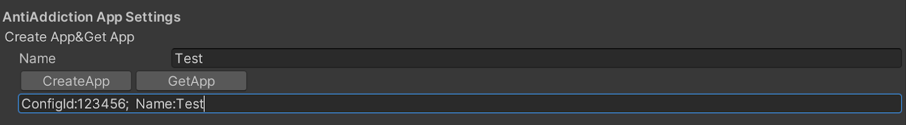

查询防沉迷APP

打开菜单**Edit ► Project Settings**，打开**Player Identity ► Backends ► Unity UserAuth**,在AntiAddiction App Settings字段中点击GetApp即可查询当前idDomain下创建的所有APP名称以及对应的configId。（在每次打开该窗口时将自动显示当前所有已创建的App）

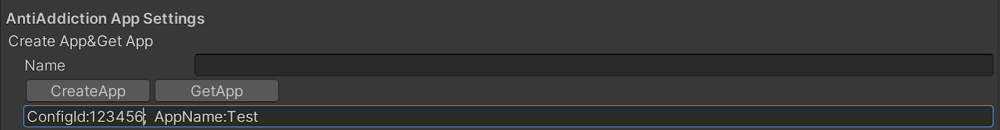

### Step3

导入防沉迷Demo

打开菜单**Window ► Package Manager**,在Player Identity(CN)中找到Samples字段，并点击button导入AntiAddiction Sample

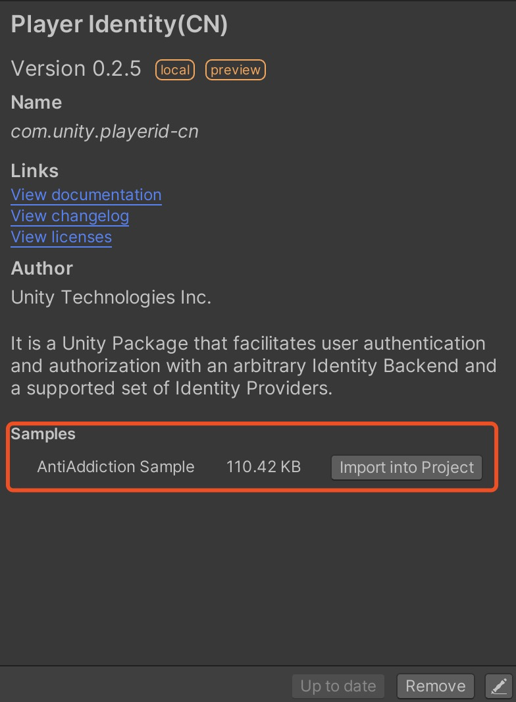

导入后可在Assets目录下看到相应的Demo目录，打开**Assets ► Samples ► Player Identity(CN) ► version ► AntiAddiction Sample ► Assets ► Scenes** 下的SampleScene即可。（可能需要导入TextMeshPro，选择导入即可）

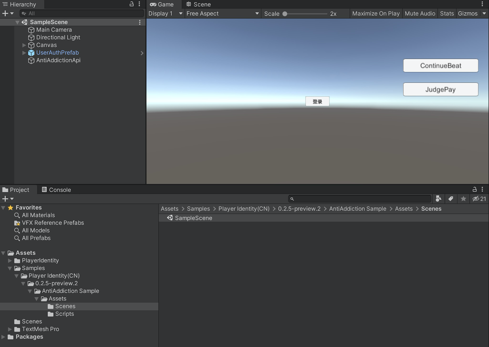

### Step4

配置防沉迷属性

在Hierarchy面板中选中AntiAddictionApi，在Inspector面板中的AntiAddictionClientApi脚本中填入Step2中获得的ConfigId。

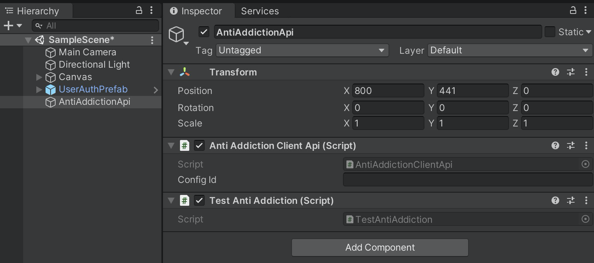

### Step5

注册防沉迷事件和调用防沉迷API完成开发

在Hierarchy面板中选中AntiAddictionApi，打开在Inspector面板中的TestAntiAddiction脚本，可参考该脚本调用防沉迷系统的API以及注册事件。

### Step6

防沉迷系统功能测试

在完成上述步骤后，即可对防沉迷功能进行测试（Demo中TestAntiAddiction脚本已经完成了API的调用和事件注册，因此在完成Step4后即可使用）。运行游戏，拉起PlayerIdentity的登录界面并登陆账号（防沉迷系统暂不支持匿名登陆，请使用其他登陆方式）。未进行实名认证的账号将拉起浏览器进行实名认证操作。

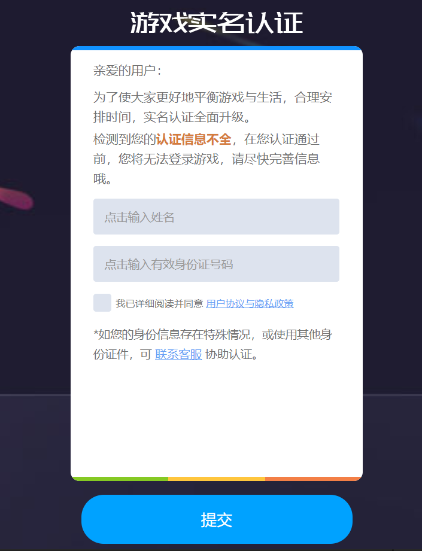

在完成实名认证后需要重新进行账号登陆，其中未成年账号将受到防沉迷系统规则限制。登陆成功后，TestAntiAddiction脚本将定时调用持续计时请求的API，也可通过场景中的button手动调用。 

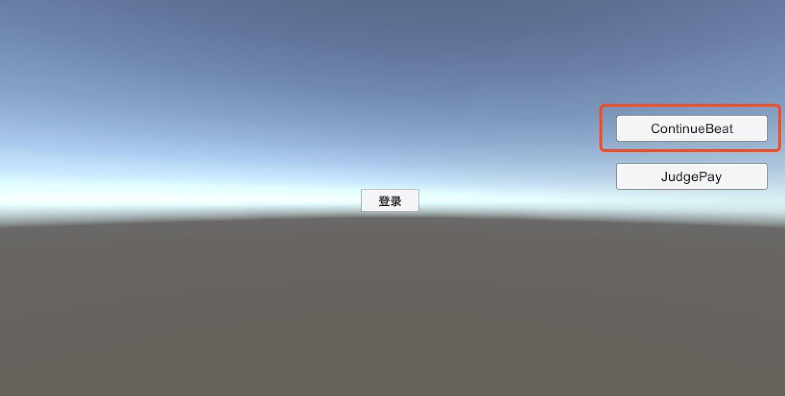

未成年用户在当日游玩超过一定时长后，服务器将根据防沉迷系统规则触发提示或强制下线指令。

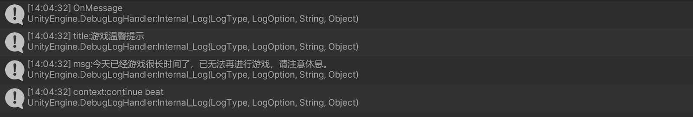

未成年玩家若当日游玩时长已到达上限或于宵禁时段登陆也会被强制下线。

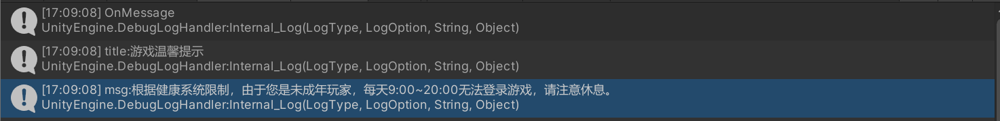

此外，每次调用该API也返回当前用户的游玩时长。

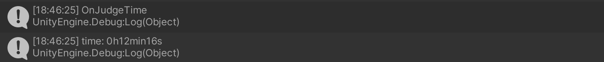

当用户进行充值操作时，通过调用充值模块API，开发者可获得用户所处年龄段，并根据年龄段设定充值上限。在Demo中可点击场景中的Button手动调用。

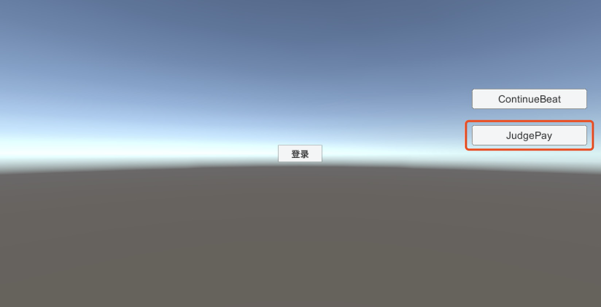

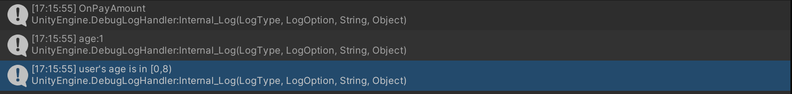

## 防沉迷系统API

| 方法名                 | 传入参数                                                    | API说明                                                      |
| ---------------------- | ----------------------------------------------------------- | ------------------------------------------------------------ |
| void ContinueHeartbeat | int duration,string context                                 | 该方法用于持续计时请求，在上一次计时有效期内调用即可，不必等到上一次计时有效期完全结束后再调用。防沉迷系统将根据当前账号的游玩时长给出相应的指令。此外，在用户成功登录后，将自动调用一次该接口，因此开发者第一次调用只需在有效时间五分钟内即可。duration为下一次计时有效时长，以秒为单位，默认300秒，最大不超过600秒。context为开发者自定义传入的内容，服务器将该内容原样返回，即仅透传。 |
| void StopHeartbeat     | int duration,string context                                 | 该方法用于结束计时请求，在用户下线，强制下线或者退出游戏时调用。可不调用，则在上一轮计时结束后，停止计时。所有参数同上。 |
| void JudgePay          | string context                                              | 该方法用于判定用户所处年龄段，在用户发起充值请求时调用，防沉迷系统将返回用户所处年龄段，由开发者依据该信息决定相应的充值限制。context同上。 |
| void ReportExecution   | string traceId, string ruleName,int execTime,string context | 在执行完对应的指令之后，需要上报该指令已执行，不需要等待回包。traceId和ruleNmae均从事件中获取直接传入，execTime为指令的实际执行时间，UTC+08的时间戳，context同上。 |

## 注册事件

| 事件名称    | 传入参数               | 事件说明                                                     |
| ----------- | ---------------------- | ------------------------------------------------------------ |
| OnMessage   | <string,string,string> | 传入三个string类型的参数，分别为title，message和context。通过该事件来获取防沉迷系统返回的消息。正常情况下，title和message会返回防沉迷文案，开发者可通过UI显示给玩家，context同上。特殊情况和异常处理也会通过该事件传入，见异常处理部分。 |
| OnKickOff   | <string,string>        | 传入两个string类型的参数，通过该事件执行强制下线操作，传入的两个参数用于执行强制下线操作后调用ReportExecution时所需的参数，第一个string类型的参数为流水号，第二个为规则名称，作为用于上报执行请求时的参数。 |
| OnJudgePay  | \<int>                 | 传入一个int类型的参数，该参数代表用户实名认证后所处的年龄段，年龄段共分为四段,[0,8)对应传入的参数为1，[8,16)对应传入的参数为8，[16,18)对应传入的参数为16，大于等于18传入的参数为模糊年龄（即传入的年龄一定大于18但并不代表用户的真实年龄） |
| OnJudgeTime | \<int>                 | 传入一个int类型的参数，该参数代表当前用户已游玩时长，单位为秒。在每次调用ContinueHeartbeat方法时通过该事件更新玩家游玩时长，建议开发者在一次有效期内（即ContinueHeartbeat中的duration时长）自行计时，在需要调用持续计时请求时再通过该事件与防沉迷服务器同步游玩时长。 |

## 防沉迷系统API调用流程

在用户登录时，防沉迷系统将自动调用登录决策请求，防沉迷系统将根据用户的状态执行指令：允许进入游戏，无法进入游戏，打开网页进行实名认证。若需要实名认证，将执行打开浏览器进行实名认证操作，此时用户在游戏内将被强制退出账号，并执行OnKickOff，用户需完成实名认证后重新登录。若玩家受到防沉迷限制（如宵禁，当日游玩时长到达上限等防沉迷系统规则），也将被强制下线。

在登录成功后，系统将自动调用一次有效期为300秒的计时请求。在该计时结束之前，若用户仍在游玩，需要再次调用持续计时请求。(开发者不用等到计时完全结束再调用该方法，可提前调用，不影响实际记录时间）当用户退出账号/游戏时，需要调用结束计时请求（也可不调用，则计时结束服务期默认玩家下线）。该方法会触发受防沉迷系统规则，从而限制未成年用户游玩。在用户触发防沉迷系统的游玩限制时，防沉迷系统将通过OnKickOff事件来强制用户下线限制用户继续游玩，在完成强制下线后，需要调用上报执行方法，将传入的流水号和指令类型直接填入即可（实际算法实现中需要先上报执行，再将用户下线，参考Demo）。

此外，该方法还会返回当前用户的游玩总时长，通过时间OnJudgeTime事件传入，开发者可根据游玩时长设定相应的游戏收益规则等。建议开发者在一次有效期内自行计时，在有效期快结束时通过调用计时请求同步更新实际游玩时长。

当用户进行充值操作时，需要调用充值决策方法，防沉迷系统将根据当前用户的状态返回用户所处年龄段，对于玩家可充值金额，由开发者自行决定限制。

## 异常处理

调用防沉迷系统API时，存在因上传数据格式错误，网络状况不良或服务器问题而返回错误异常信息，此时error信息会通过OnMessage事件传入，title为AntiAddictionServerError，msg为具体的错误信息，context同上。对于上传数据格式错误的情况，msg中会指出格式有误的target，开发者需要在开发阶段解决对应的错误，确保在玩家用户实际使用阶段不会产生数据格式错误。对于因网络状况不良或服务器问题返回错误信息，防沉迷系统默认当前用户为成年玩家，不会采取任何限制行为，开发者可以不用关注。

## 防沉迷系统现有规则

| 记录条数 | 规则类型 | 规则名称                           | 用户群体   |
| :------- | -------- | ---------------------------------- | ---------- |
| 1        | 登陆认证 | 实名认证                           | 未认证用户 |
| 2        | 时间限制 | 18岁以下晚上宵禁（22:00-次日8:00） | 全部用户   |
| 3        | 时间限制 | 18岁以下工作日1.5小时禁玩          | 全部用户   |
| 4        | 时间限制 | 18岁以下节假日3小时禁玩            | 全部用户   |
| 5        | 时间限制 | 18岁以下工作日1小时提醒            | 全部用户   |
| 6        | 时间限制 | 18岁以下节假日2小时提醒            | 全部用户   |

## 测试环境与正式环境说明（已废弃）

~~防沉迷系统分测试环境与正式环境，两个环境的数据互不相通，但都适用防沉迷系统现有规则。建议开发者先在测试环境中进行测试，没有问题再到正式环境测试。注意，测试环境仅用于开发者测试使用, 线上真实用户的请求数据都要走正式环境（包括体验服等）。~~

防沉迷系统现在只有正式环境，开发者可以直接在正式环境进行测试开发上线等操作。

